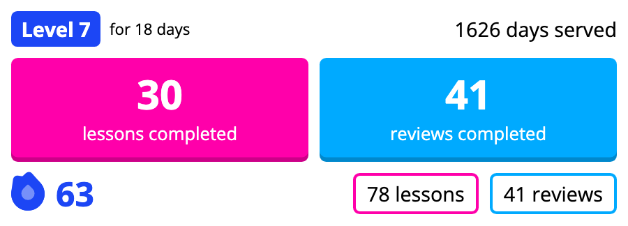

# WaniKani Discord Updates

Get daily updates in your Discord server with your WaniKani progress! This bot also tracks your streak (days with at least 1 lesson or review).

**[Add to your server](https://discord.com/api/oauth2/authorize?client_id=938595177424105534&permissions=277025705024&scope=bot%20applications.commands)**

## Commands

**`/register [api_token]`**

Register a new user to receive daily updates in the current channel. Requires a WaniKani v2 API token.

**`/unregister [@user]`**

Unregister yourself (or another user) from updates. If unregistering another user, you must have the _manage messages_ permission.

**`/streak [enabled]`**

Enable or disable showing a streak on your daily card.

**`/setstreak [number]`**

Manually set your streak to a number. Useful if you have already been using WaniKani for a while, or if you want to reset it to 0.

**`/time [hour]`**

Set the hour of each day when your update will be sent. Use GMT time (0 to 23).

**`/unregisterall`**

Remove all registrations in a server. Can only be used if you have the _manage messages_ permission.

---

## Development
1. Clone this repo
2. Run `yarn` to install dependencies
3. Create `config.json` and fill out details (use `config.example.json` as a template)
4. Optionally, run `yarn deploy-commands` to deploy Discord slash commands
5. Run `yarn start` to start the bot